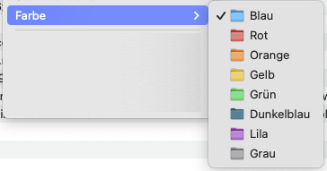

# Manila
Manila is a Finder extension that lets you change the colors of your folders from the context menu.

## About this fork
As the author seems to be inactive now, I forked this great project to add **localizations** (German for now).
I also added a **dark blue** icon colour and moved the **default blue to the top of the menu list** for an easier "reset back to original".

## Installation

Requires macOS 12.1 or later.

### Build from source
This fork requires you to build the Extension yourself in Xcode (sorry, I can't provide binaries atm).
After cloning or downloading the source, you need to change the app's `PRODUCT_BUNDLE_IDENTIFIER`, `CODE_SIGN_IDENTITY` and `DEVELOPMENT_TEAM` to your personal apple dev account settings.

### Setup for use
For **macOS 12** you need to manually enable the extension in System Preferences > Extensions > Finder Extensions.

For **macOS 13** this is now in System Preferences > Privacy & Security > Extensions > Added Extensions / Finder Extensions.
You also need to allow access to Desktop and Documents folders in System Preferences > Privacy & Security > Files & Folders.

## Usage
Right click on one or more folders whose color you want to change, go to the Color menu, and pick a color.